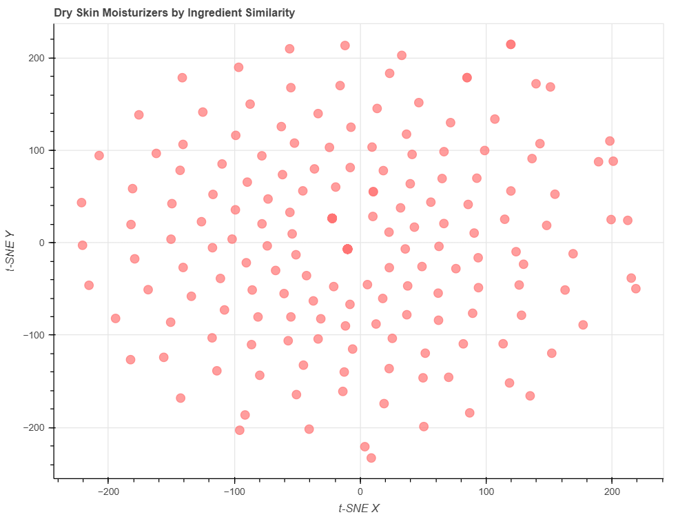

# Cosmetics Ingredient-Based Recommendation System

This project is a content-based recommendation system built using Python and machine learning techniques to suggest similar cosmetic products specifically moisturizers based on their chemical ingredient profiles.

## Objective

Help users with **dry skin** discover moisturizers that are chemically similar, safer, or more affordable, without needing to interpret complex ingredient labels.

## Dataset

- Source: Sephora cosmetic product data
- Total Products: 1472
- Categories: Moisturizer, Cleanser, Eye cream, etc.
- Skin Types: Dry, Oily, Normal, Combination, Sensitive

## Tools & Libraries

- **Python**
- **pandas, NumPy** – data manipulation
- **scikit-learn** – t-SNE for dimensionality reduction
- **Bokeh** – interactive scatter plot visualization

## Process Overview

1. **Filtered** data for moisturizers suitable for dry skin
2. **Tokenized** the ingredients list for each product
3. Created a **document-term matrix** (one-hot encoding of ingredients)
4. Applied **t-SNE** to reduce dimensionality
5. Built an **interactive Bokeh plot** to visualize ingredient similarity
6. **Compared products** visually and analytically based on ingredients

## Output

Each product is represented as a point on a 2D map. Products that are close together are more similar in their ingredient composition.

## Visualization Preview

## Example Insight

> *BB Cushion Hydra Radiance SPF 50* was found to be highly similar to *Color Control Cushion Compact SPF 50+*, but more affordable and with better ratings.

## File Structure

| File                     | Description |
|--------------------------|-------------|
| `cosmetics_recommender.ipynb` | Main Jupyter notebook with full analysis |
| `cosmetics.csv`          | Dataset used in the analysis |
| `bokeh_plot.png`         | Snapshot of the ingredient similarity plot |
| `README.md`              | Project overview and documentation |

---

